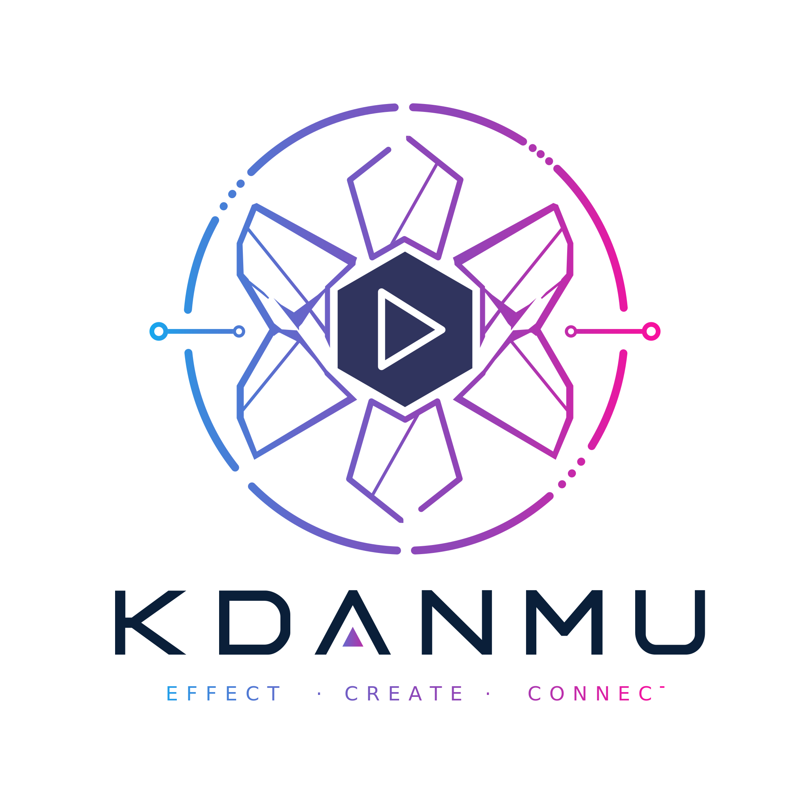

<p align="center">
  
</p>

<h1 align="center">Kaleido Danmu</h1>

<p align="center">用一句话创造画面、动画与交互 —— AI 原生的可视化创作平台。</p>

---

Kaleido Danmu 是一个 AI 原生的可视化创作平台：用自然语言描述想要的效果，浏览器内的 Coding Agent 直接生成可运行的 **Effect**（单入口 ES Module，内置 GSAP / Three.js），实时预览、版本管理、一键发布到创作广场；本地开发者也能用 `kdanmu` CLI 开发更完整的表现包并上传。网页创作与本地开发共用同一套协议、沙箱运行时和发布流程，弹幕可作为可选的创作素材接入。

## 特性

- **对话式创作**：一句话生成动效，实时预览，多轮迭代（代码不对用户暴露）。
- **浏览器内 Agent**：纯前端 Coding Agent，服务端不执行任何用户代码。
- **Effect 表现包**：单入口 ES Module + `effect.json`，版本不可覆盖，草稿 / 暂存 / 发布三档指针切换与回滚。
- **创作广场**：浏览、点赞 / 投币 / 收藏、二创已发布作品，个人主页聚合统计。
- **`kdanmu` CLI**：`init / dev / build / validate / upload / login` 本地开发与发布。
- **Mock 数据源**：点播 REST（`DmSegMobileReply` 风格）与直播 SSE 弹幕流，用于确定性预览。

## 技术栈

| 范围 | 选型 |
| --- | --- |
| 应用 | Next.js 16（App Router）+ React 19 + Tailwind v4 |
| 数据 | SQLite（better-sqlite3）+ TypeORM（实体即 Schema，`synchronize` 自建表） |
| 后端分层 | Route Handler → Service → Repository → DataSource |
| CLI | Node + Commander，tsup 构建（`bin: kdanmu`） |
| 校验 | Zod（前后端共享 `types/` 契约） |
| 测试 | Vitest（utils / schema / repository / service / route） |

## 快速开始

```bash
pnpm install
pnpm dev          # http://localhost:3000
```

常用脚本：

```bash
pnpm dev          # 启动开发服务器
pnpm build        # 生产构建
pnpm lint         # ESLint
pnpm test         # Vitest 单元/集成测试
pnpm build:cli    # 构建 kdanmu CLI（tsup → dist/cli）
pnpm kdanmu ping  # 运行 CLI
```

环境变量（可选，集中读取于 `lib/env.ts`）：

| 变量 | 默认 | 说明 |
| --- | --- | --- |
| `DB_PATH` | `./data/app.db` | SQLite 文件路径（`data/` 已 gitignore） |
| `SESSION_SECRET` | `dev-secret-change-me` | 会话签名密钥 |
| `LLM_BASE_URL` / `LLM_API_KEY` / `LLM_MODEL` | OpenAI 兼容 | LLM 代理上游；`LLM_API_KEY` 为空时 `/api/llm/proxy` 返回 503 |

## 目录结构

```text
app/            Next.js App Router（页面 + Route Handlers）
server/         服务端分层（database / repositories / services / utils / mock）
lib/            前端库 + env
cli/            kdanmu CLI 源码
types/          前后端共享的 Zod schema + DTO
docs/           技术方案与约定
public/         品牌 logo / favicon 等静态资源
```

更多设计细节见 [技术方案](./docs/bilibili-kaleidoscope-danmaku-technical-plan.md) 与 [数据库与 ORM 约定](./docs/database-orm-conventions.md)。

## License

MIT
