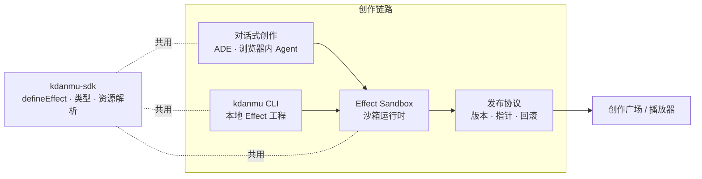

<p align="center">
  
</p>

<h1 align="center">Kaleido Danmu</h1>

<p align="center">
  <strong>用一句话，创造可自定义动画、交互的弹幕</strong><br/>
  AI 原生的可视化创作平台 —— 浏览器内的 Coding Agent × 沙箱运行时 × 创作社区
</p>

<p align="center">
  <a href="https://kdanmu.hnrobert.space"><strong>在线体验 →</strong></a>　·
  <a href="https://kdanmu.hnrobert.space/square">创作广场</a>　·
  <a href="https://kdanmu.hnrobert.space/get-started">开始使用</a>　·
  <a href="https://github.com/ji233-Sun/kaleidodanmu">GitHub 源码</a>
</p>

<p align="center">命令行也能创作：<code>npm i -g kdanmu</code></p>

<p align="center">
  
  
  
  
</p>

---

## 为什么做这个

弹幕是一种奇特的媒介。它把"看视频"这件原本孤独的事，变成几千人挤在同一秒里同时开口——可它的表达力，二十年来几乎没动过，仍是一行行从右往左飘过去的字。

想让弹幕"长出画面"的人，很快会撞上一堵墙。一个会随弹幕聚拢、碎裂、绽放的视觉效果，背后是渲染循环、坐标系、Three.js 或 Canvas、资源加载，以及那些藏在帧率里的性能陷阱。太高的门槛，得到的结果是：绝大多数人只能发文字，少数能写代码的人又把成果困在本机——没有版本，没有分享，没人在原作上接力二创。B站官方有提供高级弹幕或者异形弹幕的接口，但它们是封闭的，只有非常小规模的视频应用了类似效果，且不支持二创。但事实上，社区中在应用异形弹幕之后能获得非常好效果的作品其实非常多，但是不论是 UP 主还是观众都无法在 B 站上直接动手去做。于是我们想：如果能把创作门槛降到"一句话"，让每个人都能在浏览器里直接创作、预览、发布、二创，弹幕就能长出画面。

AI 能生成代码，乍看墙被推倒了。可生成的动效代码是野的：它联网、它引用不存在的依赖、它把还没离开屏幕的文字提前删掉、它在窄屏上错位。代码能跑，不等于它是一个作品。

Kaleido Danmu 要拆掉这堵墙。

## 思路

我们的想法落成三层：

- **把创作降维成对话。** 描述你想要的效果，浏览器内的 Coding Agent 自己写代码、自己校验、自己刷新预览，代码全程不暴露给用户。
- **但不让它"野"。** 每一段 Effect 都跑在禁网沙箱里——裸 import 被重写成同源 vendor，网络全局被接管，生命周期钉死在 `render / resize / dispose`。校验挡在发布之前，而不是事后救火。
- **让它成为作品。** 单入口 ESM，加上不可覆盖的版本号和三档发布指针（草稿 / 暂存 / 发布）。于是作品可保存、可回滚，也能被广场上的人点赞、投币、收藏、二创。

两条链路共用同一套协议、同一个沙箱、同一套发布流程。浏览器里零门槛对话，命令行里 `kdanmu init` 起一个完整工程——业余创作者与专业开发者，最终落进同一个社区。

## 特性

- **对话式创作** —— 一句话生成动效，实时预览，多轮迭代，代码不对用户暴露
- **浏览器内 Agent（ADE）** —— 纯前端 Coding Agent，仅持有 `read_file / write_file / validate / refresh_preview` 四个工具，服务端不执行任何用户代码
- **安全沙箱运行时** —— 裸 import 重写为同源 vendor URL，blob + 原生 `import()` 加载真 ESM，禁用 `fetch` 等网络全局
- **Effect 表现包** —— 单入口 ESM + `effect.json` 清单，版本不可覆盖，草稿 / 暂存 / 发布三档指针切换与回滚
- **创作广场** —— 浏览、点赞 / 投币 / 收藏、二创已发布作品，个人主页聚合统计
- **`kdanmu` CLI + SDK 脚手架** —— `init / dev / build / validate / upload / publish / login / whoami`，无参数启动交互式 TUI 主页

## 架构


```mermaid
flowchart LR
    subgraph 创作链路
        A[对话式创作<br/>ADE · 浏览器内 Agent] --> S
        C[kdanmu CLI<br/>本地 Effect 工程] --> S
        S[Effect Sandbox<br/>沙箱运行时] --> P[发布协议<br/>版本 · 指针 · 回滚]
    end
    P --> SQ[创作广场 / 播放器]
    SDK[kdanmu-sdk<br/>defineEffect · 类型 · 资源解析] -.共用.- A
    SDK -.共用.- C
    SDK -.共用.- S
```

## 快速开始

> 不想本地起服务？直接来我们的 [在线体验](https://kdanmu.hnrobert.space) 开一个作品，或在[创作广场](https://kdanmu.hnrobert.space/square)看看别人做的。

本地开发：

```bash
pnpm install
pnpm dev          # http://localhost:3000
```

### 常用脚本

```bash
pnpm dev            # 启动开发服务器（predev 自动构建 runtime vendor）
pnpm build          # 生产构建
pnpm lint           # ESLint
pnpm test           # Vitest 单元 / 集成测试
pnpm test:e2e       # Playwright 端到端测试
pnpm build:cli      # 构建 kdanmu CLI（tsup → packages/cli/dist）
pnpm build:sdk      # 构建 kdanmu-sdk
pnpm kdanmu         # 运行 CLI（如 pnpm kdanmu ping）
```

### Docker

```bash
docker compose up -d   # 使用 GHCR 预构建镜像，SQLite 持久化到 ./data
```

### 环境变量

集中读取于 `lib/env.ts`，均有默认值，本地开发开箱即用：

| 变量 | 默认值 | 说明 |
| --- | --- | --- |
| `DB_PATH` | `./data/app.db` | SQLite 文件路径（`data/` 已 gitignore） |
| `SESSION_SECRET` | `dev-secret-change-me` | 会话 / JWT 签名密钥 |
| `LLM_BASE_URL` | `https://api.openai.com/v1` | LLM 代理上游（OpenAI 兼容） |
| `LLM_API_KEY` | 空 | LLM 上游密钥；为空时 `/api/llm/proxy` 返回 503 |
| `LLM_MODEL` | `gpt-4o-mini` | LLM 模型名 |

## 技术栈

| 范围 | 选型 |
| --- | --- |
| 应用 | Next.js 16（App Router）+ React 19 + Tailwind CSS v4 |
| 数据 | SQLite（better-sqlite3）+ TypeORM（实体即 Schema，`synchronize` 自建表） |
| 后端分层 | Route Handler → Service → Repository → DataSource |
| Monorepo | pnpm workspace：`packages/sdk` · `packages/cli` · `packages/template` |
| CLI | Node + Commander + vue-tui 交互主页，tsup 构建（`bin: kdanmu`） |
| 运行时 | ES Module 沙箱 + esbuild 预打包 vendor（three / gsap / kdanmu-sdk） |
| 校验 | Zod v4（前后端共享 `types/` 契约） |
| 测试 | Vitest（unit / repository / service / route）+ Playwright e2e |

## 目录结构

```text
app/              Next.js App Router（页面 + Route Handlers）
server/           服务端分层（database / repositories / services / utils / mock）
lib/              前端库：ade（浏览器内 Agent）、runtime、env 等
cli/              kdanmu CLI 源码（构建进 packages/cli）
packages/
  ├─ sdk/         kdanmu-sdk：defineEffect、共享类型与资源解析
  ├─ cli/         可发布的 CLI 包（发布壳，产物由 tsup 生成）
  └─ template/    Effect 工程模板（kdanmu init 使用）
types/            前后端共享的 Zod schema + DTO
public/           品牌资源 + kaleido-runtime vendor（three / gsap / sdk）
scripts/          构建与检查脚本（runtime vendor 打包等）
tests/            Vitest 单元 / 集成测试
e2e/              Playwright 端到端测试
docs/             技术方案与约定
local-demo/       kdanmu init 生成的本地 Effect 演示工程
```

## 文档

- [总体技术方案](./docs/bilibili-kaleidoscope-danmaku-technical-plan.md) —— ADE + CLI 双链路架构设计
- [Effect 构建系统规范](./docs/effect-package-build-system-spec.md) —— Effect Package 的构建与发布规范
- [kdanmu CLI 使用文档](./docs/kdanmu-cli.md) —— 脚手架 → 预览 → 校验 → 上传 → 发布全流程
- [数据库与 ORM 约定](./docs/database-orm-conventions.md) —— 实体即 Schema 与 server/ 分层规范
- [API 与页面分析](./docs/api-page-gap-analysis.md) —— 前后端契约对照与实施进展

## 万花筒?

万花筒的奇妙，在于吝啬与慷慨并存。几片碎玻璃，三两面镜子，封进短短一截筒里——原料少得可怜。可手指轻轻一转，对称的图案便层层绽开，千变万化，永不重复。有限的碎片，生出了无限的图样。

Kaleido Danmu 想做的，是同一件事。

你发送的一句话，是那几片碎玻璃；沙箱运行时，是那几面镜子。你按下发送，描述落进筒里，折射、翻转、重组——一个此前从未存在过的画面，就开在屏幕上。所有人转动的是同一只筒，看到的却从不重样。

万花筒真正动人的地方，从来不是某一片玻璃，而是折射本身。在这个项目里，折射就是社区。你发布的一个效果，会被另一个人取用、改写、再转一次筒——二创，是镜子与镜子之间的互相映照，让一个意图衍射成无数种可能。广场，就是那只被所有人共同握着的万花筒。

所以叫 Kaleido。弹幕本是从同一秒钟里涌出的、成千上万种声音；我们做的，不过是递过去一面镜子，让这些声音长出对称、长出花纹、长出从未被任何人见过的形状。

## License

MIT
