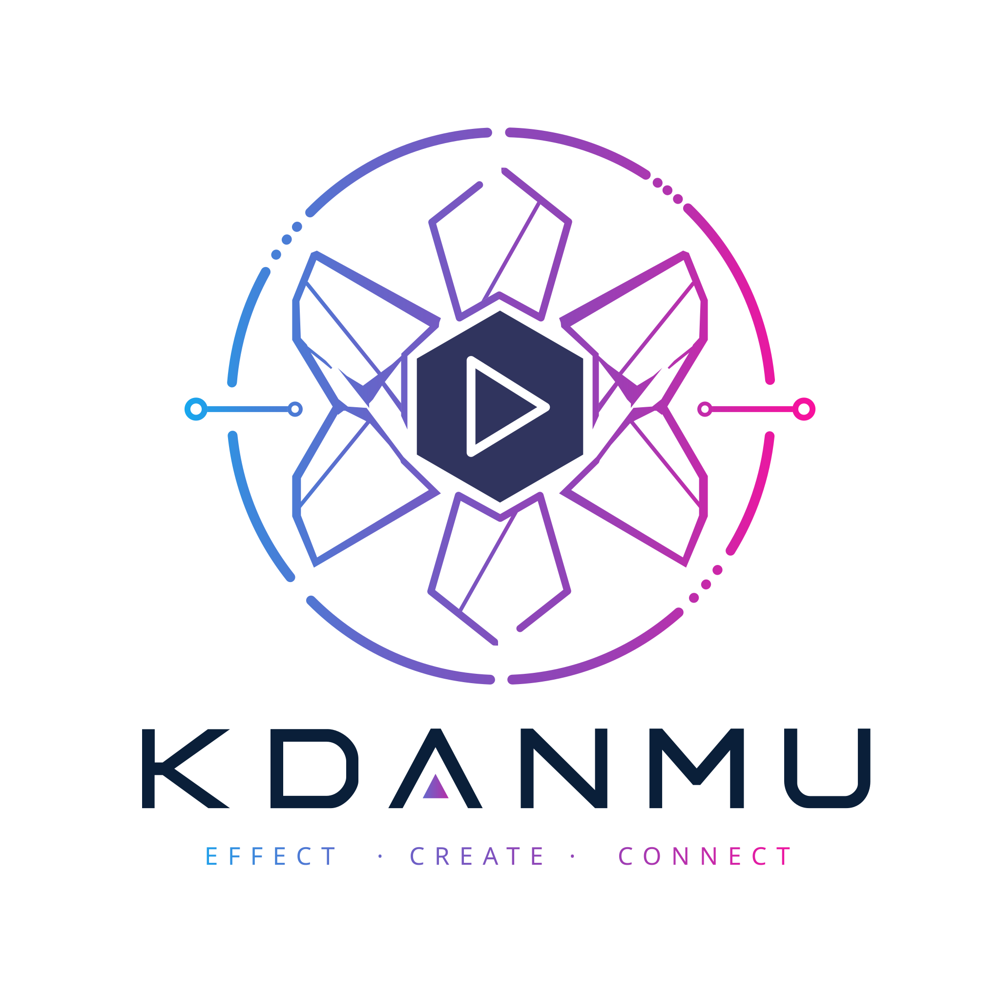
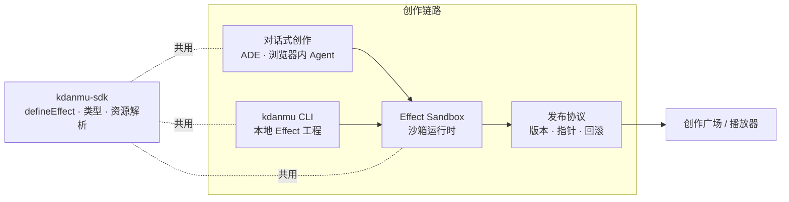

<p align="center">
  
</p>

<h1 align="center">Kaleido Danmu</h1>

<p align="center">
  <strong>用一句话创造画面、动画与交互</strong><br/>
  AI 原生的可视化创作平台 —— 浏览器内的 Coding Agent × 沙箱运行时 × 创作社区
</p>

<p align="center">
  
  
  
  
  
</p>

---

用自然语言描述想要的效果，浏览器内的 Coding Agent 直接生成可运行的 **Effect**（单入口 ES Module，内置 GSAP / Three.js），实时预览、版本管理、一键发布到创作广场；本地开发者也能用 `kdanmu` CLI 开发更完整的表现包并上传。网页创作与本地开发共用同一套协议、沙箱运行时和发布流程，弹幕可作为可选的创作素材接入。

## ✨ 特性

- **对话式创作** —— 一句话生成动效，实时预览，多轮迭代，代码不对用户暴露
- **浏览器内 Agent（ADE）** —— 纯前端 Coding Agent，仅持有 `read_file / write_file / validate / refresh_preview` 四个工具，服务端不执行任何用户代码
- **安全沙箱运行时** —— 裸 import 重写为同源 vendor URL，blob + 原生 `import()` 加载真 ESM，禁用 `fetch` 等网络全局
- **Effect 表现包** —— 单入口 ESM + `effect.json` 清单，版本不可覆盖，草稿 / 暂存 / 发布三档指针切换与回滚
- **创作广场** —— 浏览、点赞 / 投币 / 收藏、二创已发布作品，个人主页聚合统计
- **`kdanmu` CLI** —— `init / dev / build / validate / upload / publish / login / whoami`，无参数启动交互式 TUI 主页
- **Mock 数据源** —— 点播 REST 与直播 SSE 弹幕流，确定性生成，便于可复现预览

## 🏗️ 架构


```mermaid
flowchart LR
    subgraph 创作链路
        A[对话式创作<br/>ADE · 浏览器内 Agent] --> S
        C[kdanmu CLI<br/>本地 Effect 工程] --> S
        S[Effect Sandbox<br/>沙箱运行时] --> P[发布协议<br/>版本 · 指针 · 回滚]
    end
    P --> SQ[创作广场 / 播放器]
    SDK[kdanmu-sdk<br/>defineEffect · 类型 · 资源解析] -.共用.- A
    SDK -.共用.- C
    SDK -.共用.- S
```

## 🚀 快速开始

```bash
pnpm install
pnpm dev          # http://localhost:3000
```

### 常用脚本

```bash
pnpm dev            # 启动开发服务器（predev 自动构建 runtime vendor）
pnpm build          # 生产构建
pnpm lint           # ESLint
pnpm test           # Vitest 单元 / 集成测试
pnpm test:e2e       # Playwright 端到端测试
pnpm build:cli      # 构建 kdanmu CLI（tsup → packages/cli/dist）
pnpm build:sdk      # 构建 kdanmu-sdk
pnpm kdanmu         # 运行 CLI（如 pnpm kdanmu ping）
```

### Docker

```bash
docker compose up -d   # 使用 GHCR 预构建镜像，SQLite 持久化到 ./data
```

### 环境变量

集中读取于 `lib/env.ts`，均有默认值，本地开发开箱即用：

| 变量 | 默认值 | 说明 |
| --- | --- | --- |
| `DB_PATH` | `./data/app.db` | SQLite 文件路径（`data/` 已 gitignore） |
| `SESSION_SECRET` | `dev-secret-change-me` | 会话 / JWT 签名密钥 |
| `LLM_BASE_URL` | `https://api.openai.com/v1` | LLM 代理上游（OpenAI 兼容） |
| `LLM_API_KEY` | 空 | LLM 上游密钥；为空时 `/api/llm/proxy` 返回 503 |
| `LLM_MODEL` | `gpt-4o-mini` | LLM 模型名 |

## 🧰 技术栈

| 范围 | 选型 |
| --- | --- |
| 应用 | Next.js 16（App Router）+ React 19 + Tailwind CSS v4 |
| 数据 | SQLite（better-sqlite3）+ TypeORM（实体即 Schema，`synchronize` 自建表） |
| 后端分层 | Route Handler → Service → Repository → DataSource |
| Monorepo | pnpm workspace：`packages/sdk` · `packages/cli` · `packages/template` |
| CLI | Node + Commander + vue-tui 交互主页，tsup 构建（`bin: kdanmu`） |
| 运行时 | ES Module 沙箱 + esbuild 预打包 vendor（three / gsap / kdanmu-sdk） |
| 校验 | Zod v4（前后端共享 `types/` 契约） |
| 测试 | Vitest（unit / repository / service / route）+ Playwright e2e |

## 📁 目录结构

```text
app/              Next.js App Router（页面 + Route Handlers）
server/           服务端分层（database / repositories / services / utils / mock）
lib/              前端库：ade（浏览器内 Agent）、runtime、env 等
cli/              kdanmu CLI 源码（构建进 packages/cli）
packages/
  ├─ sdk/         kdanmu-sdk：defineEffect、共享类型与资源解析
  ├─ cli/         可发布的 CLI 包（发布壳，产物由 tsup 生成）
  └─ template/    Effect 工程模板（kdanmu init 使用）
types/            前后端共享的 Zod schema + DTO
public/           品牌资源 + kaleido-runtime vendor（three / gsap / sdk）
scripts/          构建与检查脚本（runtime vendor 打包等）
tests/            Vitest 单元 / 集成测试
e2e/              Playwright 端到端测试
docs/             技术方案与约定
local-demo/       kdanmu init 生成的本地 Effect 演示工程
```

## 📚 文档

- [总体技术方案](./docs/bilibili-kaleidoscope-danmaku-technical-plan.md) —— ADE + CLI 双链路架构设计
- [Effect 构建系统规范](./docs/effect-package-build-system-spec.md) —— Effect Package 的构建与发布规范
- [kdanmu CLI 使用文档](./docs/kdanmu-cli.md) —— 脚手架 → 预览 → 校验 → 上传 → 发布全流程
- [数据库与 ORM 约定](./docs/database-orm-conventions.md) —— 实体即 Schema 与 server/ 分层规范
- [API 与页面缺口分析](./docs/api-page-gap-analysis.md) —— 前后端契约对照与实施进展

## License

MIT
