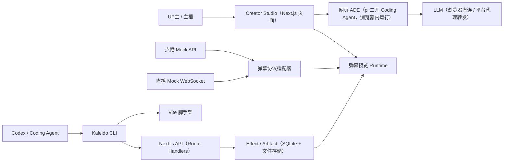

# B站万花筒弹幕原型：技术选型与实现方案

## 1. 方案摘要

核心方案是将“弹幕形式”分成两级：网页端由**简易 ADE（Agent Development Environment）**承载创作——ADE 本质是一个 Coding Agent，用户通过对话驱动生成和迭代，每轮结果立即可预览；本地 Coding Agent 通过 CLI 开发能力更完整的 **Effect Package**。两条链路共用同一套 SDK、沙箱运行时和发布协议，避免以后形成两套系统。

网页端生成的不再是一个裸 JSON：网页 ADE 本身就是一个 **Coding Agent**（参考 pi 这类极简可扩展的 coding agent 做二次开发），且**整个 Agent 纯前端运行在用户浏览器内**，服务端没有任何 Agent 执行环境，恶意操纵 Agent 的影响面被限制在用户自己的浏览器里。为了保证生成质量达标，它必须按 coding agent 的方式工作——理解需求、写工程代码、自校验、刷新预览。用户面对的是**对话界面 + 实时预览**，每次生成/修改都立即可预览，不满意就在对话里继续提要求让 Agent 改，代码不对用户暴露。ADE 运行时预置锁定版本的 **GSAP** 和 **Three.js** 两个常用前端动效库，Agent 生成代码时直接使用。网页工程本质上是在线创建的 Effect Package，之后可导出到本地用 CLI 继续开发。

产品 UI 可使用“万花筒碎片/配方”作为玩梗命名，技术协议中统一称为 Effect（网页工程与本地包同构）。

## 2. 总体架构



Creator Studio、网页 ADE 与平台 API 不再是三个独立工程：它们统一收敛进**同一个 Next.js 应用**，分别由 App Router 页面、浏览器内 Agent 内核和 Route Handlers / Server Actions 承载；CLI 与沙箱 Runtime 仍是独立的 Node 工具与包。

## 3. 技术选型

| 范围 | 选型 | 说明 |
| --- | --- | --- |
| 应用形态 | 单一 Next.js 应用（App Router）+ TypeScript | 原型阶段不拆 monorepo；CLI、沙箱 Runtime 等需要被独立复用的部分后续按需抽到 `packages/` |
| Creator Studio | Next.js（App Router + RSC）+ Tailwind | Prompt、对话式创作界面、实时预览、版本切换，全部作为 Next.js 页面/路由；代码不对用户暴露 |
| 网页 ADE 内核 | 基于 pi 二开的 Coding Agent（纯前端运行） | pi 是极简、可扩展的 coding agent，适合二次开发：Agent loop 与工具全部在浏览器内执行，工程存浏览器虚拟文件系统，服务端无 Agent 执行环境；内置 GSAP 与 Three.js 锁定版本 |
| 渲染运行时 | Canvas 2D + DOM Overlay + WebGL | GSAP 驱动 DOM/Canvas 属性补间与时间轴；Three.js 提供 WebGL 图层（粒子、镜像、后期）；瓶颈验证后再扩展自定义 Shader |
| 服务端 | Next.js（Route Handlers / Server Actions） | 认证、上传、版本、Mock REST 与 LLM 代理转发统一在 Next.js 服务端；直播 Mock WebSocket 由独立 Node 进程承载，Route Handler 只做握手与鉴权 |
| Schema | Zod + JSON Schema | 前后端、CLI、Manifest、消息协议共用类型 |
| 数据 | SQLite（better-sqlite3）+ TypeORM + 本地文件 ArtifactStore | 原型零外部依赖；实体即 Schema、`synchronize` 自建表；生产替换为 PostgreSQL + 对象存储（详见 §3.1） |
| CLI | Node.js + Commander | `init/dev/build/validate/upload/login/logout` |
| 测试 | Vitest + Playwright | 协议、确定性渲染、视觉回归、CLI 集成测试 |
| 日志 | Pino | 结构化日志；生产阶段再接 OpenTelemetry |

> Web 端开发服务器由 `next dev` 承担；下面的 Vite 程序化 API 仅用于 **CLI** 的 `kaleido dev`（启动隔离的表现包预览壳，支持 HMR）和 `kaleido build`（`build.lib` 产出 ES Module）。Vite 不作为 Web 应用本身的构建链。

Vite 8 官方文档确认可以通过 `createServer()` 提供程序化开发服务器和 HMR，并使用 `build.lib` 生成 ES Module 形式的表现包：

- [JavaScript API](https://vite.dev/guide/api-javascript)
- [Library Mode](https://vite.dev/guide/build.html#library-mode)
- [Plugin API](https://vite.dev/guide/api-plugin)

### 3.1 数据层与 ORM

数据层采用 **TypeORM + better-sqlite3**：实体即 Schema，原型阶段用 `synchronize` 自动建表，零外部依赖、零迁移脚本；生产可平滑切到 PostgreSQL（换驱动 + 关 `synchronize` + 引入迁移）。所有数据库访问都在 Route Handlers / Server Actions 的服务端完成，浏览器侧不直接接触数据库。

连接定义、启动初始化、配置项、实体约定、实体清单与代码示例、Route Handler 用法，以及原型期约定与生产演进，统一见 **[数据库与 ORM 约定](./database-orm-conventions.md)**。

## 4. 核心领域协议

所有来源先归一化，渲染器不直接依赖 B 站数组下标或内部协议：

```ts
interface DanmakuEvent {
  id: string
  source: "vod" | "live"
  text: string
  videoTimeMs?: number
  receivedAt: number
  mode: "scroll" | "top" | "bottom"
  color: number
  fontSize: number
  weight: number
  seed: number
}
```

点播 Mock 提供 `DmSegMobileReply` 风格的 `{ elems: [...] }`，保留 `id/progress/mode/fontsize/color/midHash/content/ctime/weight/pool/idStr` 等字段。

直播 WebSocket 模拟鉴权、心跳和 `op:5` 消息体，推送 `{ cmd: "DANMU_MSG", info: [...] }`。这些只是兼容性 fixture，不承诺等同于 B 站当前私有协议；分别由 `VodAdapter` 和 `LiveAdapter` 转成 `DanmakuEvent`。

视频使用仓库内合法的短视频素材，通过 `loop` 循环播放。点播数据按视频时间轴调度；直播数据由固定随机种子生成，支持暂停、倍率和突发流量，保证测试可复现。

## 5. 网页 ADE 与本地表现包

### 5.1 网页 ADE（Agent Development Environment）

网页 ADE 的核心是一个 **Coding Agent**，且**整个 Agent 运行在用户浏览器内**（纯前端方案）：服务端没有任何 Agent 执行环境，用户即使恶意操纵 Agent，影响面也被限制在自己的浏览器沙箱里，无法触达服务端文件系统、凭证或其他用户数据。生成质量要达标，它必须像 coding agent 一样工作，而不是一次性文本补全。内核参考 pi 这类极简 coding agent 的设计做二次开发（编译为浏览器可运行的形态），注入领域系统提示词和自定义工具。ADE 的构成：

- **Coding Agent 内核（浏览器内）**：基于 pi 二开。Agent loop、工具调用、工程维护全部在浏览器中执行；LLM 请求从浏览器直连（原型支持用户自带 API Key）或经平台代理转发，代理只做转发和限流，不执行任何代码。
- **对话界面**：用户只通过自然语言描述想要的效果和修改意见；**代码不对用户暴露**，界面只呈现对话、预览和版本历史。
- **浏览器内虚拟文件系统**：工程文件存放在浏览器内存 FS / OPFS 中，Agent 工具（`read_file` / `write_file` / `validate` / `refresh_preview`）全部作用于这个虚拟 FS，不触达真实文件系统；草稿定期同步到服务端仅作持久化，服务端收到的是静态产物。
- **工程结构**：单入口 ES Module + 参数配置，与本地 Effect Package 同构，可导出到本地用 CLI 继续开发。
- **内置动效库**：ADE 运行时预置锁定版本的 **GSAP**（补间与时间轴）和 **Three.js**（WebGL 场景），Agent 生成代码时直接 `import { gsap } from "gsap"` / `import * as THREE from "three"` 使用；版本由平台锁定，不允许引入其他第三方依赖或外部资源。
- **实时预览**：与发布时相同的沙箱 Runtime，Agent 每次写码后自动刷新，效果立即可见；校验和运行错误在浏览器内回流给 Agent，形成“生成 → 预览 → 自我修正”的闭环。

### 5.2 网页产物的安全模型

网页 ADE 生成的是**可执行代码**，因此与本地上传包**共用同一条沙箱链路**：代码在 `sandbox="allow-scripts"` 的隔离 iframe 中执行，CSP 禁止网络请求和外部资源，GSAP/Three.js 由沙箱宿主预置注入。由于 Agent 本身也纯前端运行，服务端**从不执行任何用户相关代码**——无论是 Agent 的工具调用还是生成的产物；服务端只在保存草稿/发布时接收静态文件并做校验（包体大小、禁止的 API 模式、入口格式），运行时的帧率/心跳监控同样生效。网页工程本质上就是一个在线创建的 Effect Package，只是创建方式不同、资源配额更紧。

### 5.3 本地表现包

本地表现包使用以下稳定生命周期：

```ts
export default defineEffect({
  setup(context) {
    return { onEvent, render, resize, reset, dispose }
  }
})
```

上传物包含 `effect.json`、单个 ES Module 入口、静态资源及 SHA-256。Manifest 声明 `schemaVersion`、`sdkVersion`、版本号、入口、能力和资源限制。版本不可覆盖，通过 `draft/staging/published` 指针切换和回滚。

## 6. 两条创作流程

### 6.1 网页生成流程

输入 Prompt → 浏览器内的 Coding Agent 生成动效工程代码（单入口 ES Module，可直接使用内置 GSAP / Three.js）→ Agent 在浏览器内调用 `validate` 自校验，必要时自我修正 → 沙箱预览自动刷新，用户直接看到效果；草稿同步到服务端仅作持久化。

用户不满意就在对话里继续提修改意见，Agent 在原有工程上增量改写并再次刷新预览；代码全程不对用户暴露。预览提供点播/直播切换、时间轴、弹幕速率、随机种子、FPS 和运行错误（运行错误同时回流给 Agent 用于自我修复）。网页工程可一键导出为本地 Effect Package 脚手架，用 CLI 继续开发。

### 6.2 本地开发流程

```bash
kaleido login
kaleido init my-effect
kaleido dev
kaleido validate
kaleido build
kaleido upload --channel draft
```

`dev` 通过 Vite 程序化服务器启动官方预览壳并支持 HMR；`build` 固定生成 ES Module、排序资源并计算内容哈希；`upload` 默认只创建草稿，发布使用独立的 `publish` 命令，避免 Agent 意外上线。

## 7. 登录、授权与 Skill

CLI 首选浏览器 Authorization Code + PKCE：监听随机 `127.0.0.1` 回调端口、打开授权页、交换短期 access token；无浏览器环境提供 Device Code。

Refresh token 存入系统 Keychain、Credential Manager 或 Secret Service。`logout` 同时在服务端吊销并清理本地凭证，绝不保存 B 站 Cookie。

配套 Codex Skill 应指导 Agent：

- 先执行 `kaleido whoami --json`，未认证时调用 `login`。
- 读取 Manifest 和 SDK 版本，禁止自行猜测协议。
- 修改后依次执行 `validate`、测试、`build`。
- 用户明确要求上传后才执行 `upload --json`，并返回版本 URL 和哈希。
- 上传草稿可自动化；公开发布必须单独确认。
- 不读取或输出 token，不绕过包体、网络和权限限制。

CLI 的 `--json` 输出、稳定退出码和幂等键是 Agent 自动操作的关键，比自然语言日志更重要。

## 8. 安全边界

所有用户代码——网页 ADE 生成的和本地 CLI 上传的——统一从独立静态域名加载到 `sandbox="allow-scripts"` 且不带 `allow-same-origin` 的 iframe，使用 CSP 禁止网络、表单、弹窗和下载；GSAP/Three.js 由沙箱宿主以锁定版本预置注入，生成代码无法加载任何外部资源。父页面通过一次性 `MessageChannel` 发送弹幕事件，不向 iframe 暴露登录态、媒体元素或 API token。

服务端校验路径穿越、文件数量、扩展名、Manifest、SDK 版本、包体大小和 SHA-256。建议初始限制为压缩包 1 MB、资源 5 MB、活跃弹幕 200 条、文本 100 字；运行时检测心跳和连续掉帧，异常时卸载表现包。

## 9. 仓库结构

原型阶段是一个**单一 Next.js 应用**（不再拆 `apps/`）。当前已落地与规划的核心目录：

```bash
├── app/                     # Next.js App Router
│   ├── (studio)/...         # Creator Studio 页面：对话创作、预览、版本切换
│   ├── ade/...              # 网页 ADE 宿主页（加载浏览器内 Agent 内核）
│   └── api/                 # Route Handlers（HTTP 编排，只调 service）
│       ├── effects/...      # Effect 与版本的 CRUD、发布与回滚
│       ├── upload/...       # Effect Package 上传与校验
│       ├── auth/...         # 登录 / 会话
│       ├── mock/            # mock/vod 点播 REST · mock/live 直播 WebSocket 握手代理
│       └── llm/proxy        # LLM 请求转发与限流（不执行任何代码）
├── server/                  # 服务端代码（route → service → repository → data-source 分层）
│   ├── database/
│   │   ├── data-source.ts   # AppDataSource 单例 + init/close（better-sqlite3 + synchronize）
│   │   └── entities/        # TypeORM 实体（user / session / effect / effectVersion / draft / apiToken / appSetting）
│   ├── repositories/        # 数据访问封装（如 effect.repository.ts）
│   └── services/            # 业务逻辑（如 effect.service.ts）
├── lib/
│   ├── env.ts               # 环境变量集中读取（DB_PATH / SESSION_SECRET 等）
│   ├── cli/                 # Kaleido CLI 源码（tsup 构建 → dist/cli/index.js，bin: kaleido）
│   ├── ade/                 # 浏览器内 Agent 内核与工具集（pi 二开，纯前端）
│   ├── schema/              # Manifest、消息 Schema（Zod + JSON Schema）
│   ├── runtime/             # 调度、沙箱、播放器叠加层（预览与沙箱宿主复用）
│   ├── adapters/            # VOD / Live 协议适配
│   └── fx/                  # 沙箱预置的 GSAP / Three.js 锁定版本与类型声明
├── components/              # UI 组件（对话、预览壳、版本面板）
├── types/                   # 跨层共享类型
├── instrumentation.ts       # 服务端启动时初始化 DataSource（NEXT_RUNTIME 守卫）
├── next.config.ts           # serverExternalPackages: ['better-sqlite3']
├── tsconfig.json            # experimentalDecorators / emitDecoratorMetadata
├── tsup.config.ts           # CLI 构建（lib/cli → dist/cli，target node24）
├── data/                    # 运行时 SQLite 文件（.gitignore，DB_PATH 默认 ./data/app.db）
└── dist/                    # tsup CLI 产物（.gitignore）
```

服务端分层：`app/api/*` 只做 HTTP 编排，业务逻辑在 `server/services/`，表读写封装在 `server/repositories/`，连接与实体在 `server/database/`。

**CLI 构建**：`kaleido` 的源码在 `lib/cli/`，由 tsup（`tsup.config.ts`，target node24）编译为 `dist/cli/index.js`（CJS、注入 shebang），经根 `package.json` 的 `bin` 注册为 `kaleido` 命令。`pnpm build:cli` 构建；本地用 `pnpm kaleido <cmd>` 或 `node dist/cli/index.js` 运行；包被安装/发布后 `kaleido` 命令直接可用。CLI 复用 app 的 tsconfig，但有独立入口与构建、不依赖 Next.js 运行时。独立沙箱 Runtime 与内置示例需要被应用外复用时再抽到 `packages/`。

## 10. 实施顺序

1. 第一阶段：循环视频、两种 Mock 数据源、归一化协议、经典弹幕和一个“玻璃碎片”效果。
2. 第二阶段：网页 ADE（pi 二开的 Coding Agent 内核、对话界面、预置 GSAP + Three.js）、生成自校验与自我修复、沙箱确定性预览和版本保存。
3. 第三阶段：SDK、Vite 模板、CLI build/validate、沙箱加载和草稿上传。
4. 第四阶段：PKCE/Device Code、Skill、版本发布回滚、视觉回归和安全限制。

## 11. 原型验收标准

- 点播 Seek 后弹幕可以按时间线准确重放。
- 直播连接断开后可以恢复，且不会重复消费已经确认的事件。
- 同一工程代码、随机种子和事件序列产生一致画面。
- 网页生成结果每轮对话后立即可预览，多轮修改在同一工程上增量生效，代码对用户不可见。
- Agent 生成代码可以直接使用内置 GSAP / Three.js，且能通过 `validate` 和预览错误回流完成自我修复。
- 服务端没有任何 Agent 执行环境：Agent loop 与工具调用全部发生在用户浏览器内，服务端只接收静态产物。
- Prompt 生成的代码在沙箱中无法访问网络、外部资源或父页面状态。
- CLI 从登录到上传可以无人工复制 token 完成。
- 错误表现包不会影响播放器和 Creator Studio 主页面。
- 上传的版本不可原地覆盖，可以切换和回滚。

## 12. 原型范围外事项

生产化之前再接入真实对象存储、PostgreSQL、正式身份系统以及经过授权的 B 站数据源。由于数据层基于 TypeORM，从 SQLite 切到 PostgreSQL 主要是把 DataSource 的 `type` 改为 `'postgres'`、关闭 `synchronize` 并引入正式迁移，业务代码基本不动。原型阶段不接入私有接口、不保存用户 Cookie，也不实现协同编辑、公开市场、计费或复杂审核工作流。

这一范围符合 KISS 和 YAGNI：先验证“Prompt 生成并预览”与“Agent 本地开发并上传”两条核心链路，同时通过统一协议、Schema 和沙箱边界保留后续扩展能力。
